# Autolinium Entity-Relationship (ER) Diagram

Based on the requirements, here is the proposed database structure using an Entity-Relationship Diagram. This visualizes how the different data tables in our PostgreSQL database will connect to each other.

```mermaid
erDiagram
    Users ||--o{ Attendance : has
    Users ||--o{ MonthlyKPI : receives
    Users ||--o{ PeerReview : gives_review
    Users ||--o{ PeerReview : receives_review
    Users ||--o{ ProjectTask : gets_assigned
    Users ||--o{ InternalMeetingAttendee : attends
    Users ||--o{ ClientMeetingAttendee : attends
    Users ||--o{ WeeklyReport : submits
    Users ||--o{ LeaveRequest : requests

    InternalMeeting ||--o{ InternalMeetingAttendee : includes
    ClientMeeting ||--o{ ClientMeetingAttendee : includes

    Users {
        int id PK
        string name
        string email
        string password_hash
        string role "ADMIN, EMPLOYEE"
        float base_salary
        datetime created_at
    }

    Attendance {
        int id PK
        int user_id FK
        date record_date
        time entry_time
        time exit_time
        string presence_status "PRESENT, ABSENT"
        string absence_info "INFORMED, UNINFORMED, GRANTED, NOT_GRANTED"
        string late_status "TIMELY, LATE_AUTO, LATE_INFORMED, LATE_UNINFORMED"
        time promise_time "If informed late"
        int work_minutes
        int overtime_minutes
        boolean admin_override
    }

    LeaveRequest {
        int id PK
        int user_id FK
        date start_date
        date end_date
        string reason
        string status "PENDING, APPROVED, REJECTED"
        datetime requested_at
    }

    InternalMeeting {
        int id PK
        string name
        date meeting_date
        string agenda
        int created_by FK
    }

    InternalMeetingAttendee {
        int meeting_id FK
        int user_id FK
        string status "ATTENDED, INFORMED_SKIP, UNINFORMED_SKIP"
    }

    ClientMeeting {
        int id PK
        string client_name "Select from Client DB"
        datetime scheduled_time
        int created_by FK
    }

    ClientMeetingAttendee {
        int meeting_id FK
        int user_id FK
        time join_time
        string status "ATTENDED, INFORMED_SKIP, UNINFORMED_SKIP"
        int behavior_penalty "0-10 admin defined"
    }

    PeerReview {
        int id PK
        int reviewer_id FK
        int target_user_id FK
        int month
        int year
        int respect_score "1-10"
        int helpfulness_score "1-10"
        int attitude_score "1-10"
        int conflict_score "1-10"
        int knowledge_share_score "1-10"
        float average_score "Calculated"
    }

    ProjectTask {
        int id PK
        string title
        string description
        int assigned_user_id FK
        date deadline
        date completed_date
        string status "PENDING, DONE"
        string valid_reason
        boolean informed_before_deadline
        int fault_delay_days
    }

    WeeklyReport {
        int id PK
        int user_id FK
        date week_start_date
        datetime submitted_at
        string content
        boolean missing_knowledge_share
    }

    MonthlyKPI {
        int id PK
        int user_id FK
        int month
        int year
        float kpi_1_attendance "Max 10"
        float kpi_2_timeliness "Max 10"
        float kpi_3_internal_meetings "Max 10"
        float kpi_4_client_meetings "Max 10"
        float kpi_5_peer_review "Max 10"
        float kpi_6_deadlines "Max 10"
        float kpi_7_weekly_report "Max 10"
        float kpi_8_value_added "Max 25 (Admin Input)"
        float kpi_9_innovation "Max 5 (Admin Input)"
        float total_score "Max 100"
        float bonus_earned
    }
```

### Explanation of Key Tables:
- **Users**: This is the core table representing both Admins and Employees. Every other table links back to a specific user.
- **Attendance**: This table will log each day's check-in and check-out. It contains complex string statuses (`presence_status`, `absence_info`, `late_status`) that the backend will use to calculate KPI 1 (Attendance) and KPI 2 (Timeliness & Overtime).
- **KPI Core Tables**: We have separate tables for `InternalMeeting`, `ClientMeeting`, `PeerReview`, `ProjectTask`, and `WeeklyReport`. These represent actions or events that hold their own data.
- **MonthlyKPI**: Instead of calculating the KPI dynamically every time someone visits the dashboard (which would be slow and heavy on the database), the backend will calculate and store the final scores here at the end of each month (or update them periodically).

Would you like to proceed to initializing the Next.js (Admin Panel) and Node.js (Backend) codebases, or would you like to tweak this schema first?
